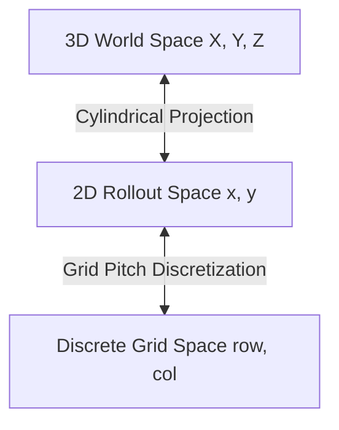
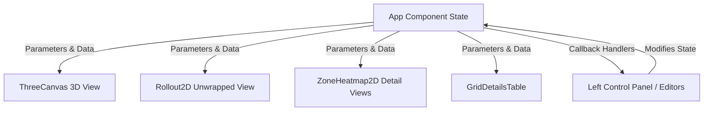

# Vessel Thermal Mapping Dashboard - Technical Specification

This document details the engineering math, coordinate transformations, simulation algorithms, and code architecture implemented in [vessel-multi-zone V3.html](file:///C:/progs/SRU%20prog/vessel-multi-zone%20V3.html).

---

## 1. Coordinate Systems & Geometry

The application maps data between three distinct coordinate spaces:
1. **3D World Space (Three.js)**: Cartesian $(X, Y, Z)$ coordinates where the vessel lies horizontally along the $X$-axis.
2. **2D Rollout Space (Unwrapped Surface)**: Plane $(x, y)$ coordinates representing the unwrapped cylinder shell.
3. **Discrete Grid Space (Measurement Cells)**: Matrix indices $(r, c)$ corresponding to the transverse and longitudinal cell divisions of a zone.



### 1.1 Vessel Parameters
- **Shell Length ($L$)**: Extent of the cylinder along the $X$-axis.
- **Diameter ($D$)**: Outer diameter of the shell.
- **Shell Radius ($R$)**: $R = D / 2$.
- **Head Depth ($h_d$)**: Depth of the hemispherical/ellipsoidal heads on either end ($x < 0$ and $x > L$), set to $R \times 0.4$.

---

## 2. Mathematical Transformations

### 2.1 Clock Hour to Angular Position
In industrial vessel inspection, circumferential position is referenced via a 12-hour clock face when viewing the vessel from the left end. 
- **12 o'clock** represents the top center ($0$ rad or $\pi/2$ rad relative to normal axis).
- **3 o'clock** represents the right side.
- **6 o'clock** represents the bottom center.
- **9 o'clock** represents the left side.

The conversion from clock hour $h \in [1, 12]$ to angle $\theta$ (in radians, measured counter-clockwise from the positive Z-axis in Three.js coordinates) is defined in [clockToAngle](file:///C:/progs/SRU%20prog/vessel-multi-zone%20V3.html#L136):

$$\theta = \left( -\frac{(h \pmod{12}) \cdot \pi}{6} + 2\pi \right) \pmod{2\pi}$$

### 2.2 Arc Span and Circumferential Mapping
A zone is bounded by starting hour $h_{start}$ and ending hour $h_{end}$. The clockwise angular sweep (span) $\Delta\theta$ is calculated in [getArc](file:///C:/progs/SRU%20prog/vessel-multi-zone%20V3.html#L137):

$$\theta_{start} = \text{clockToAngle}(h_{end})$$
$$\theta_{end} = \text{clockToAngle}(h_{start})$$
$$\Delta\theta = (\theta_{end} - \theta_{start}) \pmod{2\pi}$$

If $\Delta\theta \le 0.001$, it is set to $\Delta\theta + 2\pi$ to handle wrapping.
The circumferential arc length $S$ of the zone on the cylinder surface is:

$$S = R \cdot \Delta\theta$$

### 2.3 Clock Hour to 2D Rollout Y-Coordinate
For the unwrapped 2D canvas, the vertical axis represents the total circumference $C = \pi D$. 12 o'clock is centered at $C/2$. The Y-coordinate mapping for hour $h$ is defined in [clockHourToY](file:///C:/progs/SRU%20prog/vessel-multi-zone%20V3.html#L138):

$$y = \left( \left( \frac{C}{2} - (h \pmod{12}) \cdot \frac{C}{12} \right) \pmod C + C \right) \pmod C$$

---

## 3. Discretization & Grid Sizing

Each zone has a specified:
- **Longitudinal pitch ($P_L$)**: The distance between measurement points along the length.
- **Transverse pitch ($P_T$)**: The distance between measurement points along the arc sweep.

The number of cells in the longitudinal direction ($N_L$) and transverse direction ($N_T$) is calculated as:

$$N_L = \max\left(1, \left\lfloor \frac{\Delta x}{P_L} \right\rfloor\right)$$

$$N_T = \max\left(1, \left\lfloor \frac{R \cdot \Delta\theta}{P_T} \right\rfloor\right)$$

---

## 4. Thermal Data Simulation Algorithm

The thermal simulation creates dynamic, realistic temperature maps using a combination of random noise, spatial smoothing, and Gaussian heat/cold source distribution. The logic is defined in [generateThermalData](file:///C:/progs/SRU%20prog/vessel-multi-zone%20V3.html#L63):

```
Initialize Grid Matrix with dimensions (N_T x N_L)
For each cell (r, c):
    Set Temp(r, c) = BaseTemp + Random(-1, 1) * Variance

Apply 5-Point Box Blur Smoothing Pass:
    SmoothTemp(r, c) = [ Temp(r,c) + Neighbors(up, down, left, right) ] / Count

For each Hotspot (1 to HotspotCount):
    Select random center coordinates (Hr, Hc)
    Calculate random radius = HotspotRadius * Random(0.75, 1.25)
    For each cell (r, c):
        d = sqrt((r - Hr)^2 + (c - Hc)^2)
        GaussianIntensity = exp(-d^2 / (2 * radius^2))
        Temp(r, c) += HotspotIntensity * GaussianIntensity * Random(0.85, 1.15)
```

### Gaussian Influence Formula
The thermal impact of a hotspot at cell distance $d$ from the center is modeled as:

$$T_{\text{add}}(d) = I \cdot e^{-\frac{d^2}{2\sigma^2}} \cdot \eta$$

Where:
- $I$ is the intensity ($^\circ\text{C}$).
- $\sigma$ is the spot radius in grid cells.
- $\eta \sim \mathcal{U}(0.85, 1.15)$ is a scaling factor for local noise.

---

## 5. UI Architecture and Data Flow

The application is built around standard React unidirectional data flow:



- **State Management**: Key values (vessel dimension, zones array, thermal maps, editor expanded state) live in the top-level [App](file:///C:/progs/SRU%20prog/vessel-multi-zone%20V3.html#L534) component.
- **Three.js Synchronization**: The [ThreeCanvas](file:///C:/progs/SRU%20prog/vessel-multi-zone%20V3.html#L234) component initializes the WebGLRenderer, Scene, and Camera. Whenever the vessel dimensions or zones configuration changes, it rebuilds the meshes dynamically in [buildVessel](file:///C:/progs/SRU%20prog/vessel-multi-zone%20V3.html#L144) and updates the scene.
- **Orbit Controls Hook**: The custom [useOrbit](file:///C:/progs/SRU%20prog/vessel-multi-zone%20V3.html#L114) hook intercepts pointer events on the canvas, recalculating camera position using spherical coordinates:
  $$X = X_{target} + r \cdot \sin\phi \cdot \cos\theta$$
  $$Y = Y_{target} + r \cdot \cos\phi$$
  $$Z = Z_{target} + r \cdot \sin\phi \cdot \sin\theta$$
